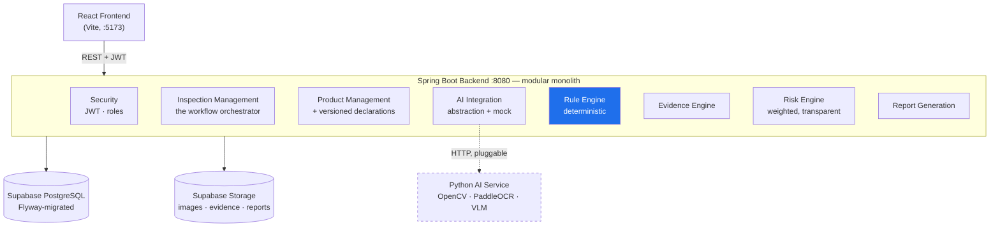
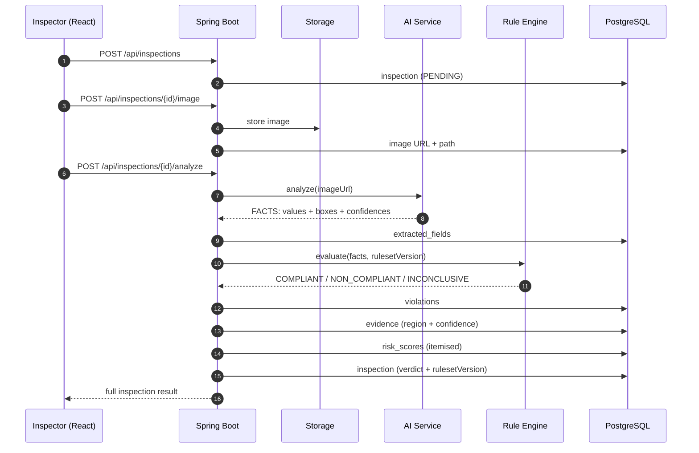
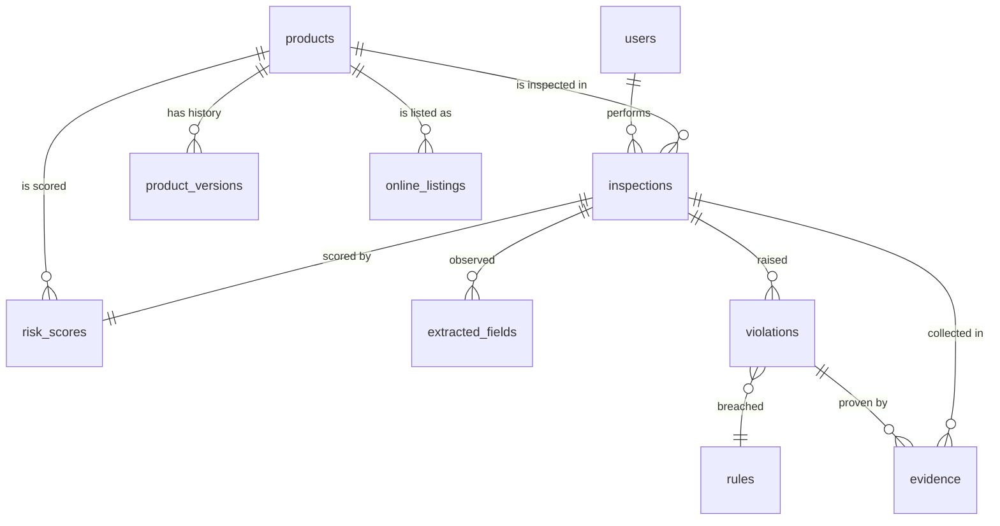

# LM-GUARD — Backend

**AI-assisted, evidence-first Legal Metrology inspection platform.**

LM-GUARD helps Legal Metrology inspectors examine packaged commodities. An inspector photographs a
package; the system extracts what is declared on it, evaluates those declarations against a
versioned ruleset, and hands back a verdict that is backed by evidence and a transparent risk
score.

---

## 1. The one idea this codebase is built around

> **The AI decides what is *visible*. A deterministic rule engine decides what is *legal*. A human
> inspector decides what is *enforced*.**

That separation is enforced structurally, not by convention:

| Layer | Responsibility | May it decide compliance? |
|---|---|---|
| `ai/` | Extract facts from an image: values, pixel regions, confidences | **No** |
| `rules/` | Evaluate facts against a versioned ruleset | **Yes — and only here** |
| `evidence/` | Record the image region and confidence behind every finding | No |
| `risk/` | Score how much attention a product deserves | No |
| Inspector | Enforcement | **Final authority** |

Three consequences worth understanding before you read the code:

1. **`INCONCLUSIVE` is a first-class outcome.** A declaration read with low confidence is reported
   as `INCONCLUSIVE`, never as a violation. A blurred photograph is not evidence that a label is
   missing. This is the single most important behaviour in the system, and it is pinned by tests.
2. **Every finding carries evidence.** A violation without an image region, a confidence and a rule
   reference is just an assertion. `evidence` rows make findings verifiable.
3. **Rules are versioned data, not code.** Each inspection records the exact `ruleset_version` it
   was judged under, so a decision made months ago can still be reproduced and defended today.

> ⚠️ **The rules shipped in this repository are clearly marked demo/sample rules.** They are *not*
> the Legal Metrology Act, 2009 or the Legal Metrology (Packaged Commodities) Rules, 2011, and they
> are *not* legally verified. They exist so the engine can be developed and demonstrated. Replace
> `src/main/resources/rules/sample-rules.json` with a ruleset reviewed by a qualified Legal
> Metrology authority before any real-world use.

---

## 2. Architecture



The rule engine is highlighted because it is the only component permitted to reach a compliance
conclusion.

### The inspection pipeline



Note the ordering: facts are persisted **before** they are judged, so a verdict can always be
re-derived from what was actually observed.

### Data model



---

## 3. Tech stack

| Area | Choice |
|---|---|
| Language / runtime | Java 21 |
| Framework | Spring Boot 3.4 (Web, Data JPA, Validation, Security) |
| Build | Maven (wrapper included) |
| Database | PostgreSQL via **Supabase** |
| Migrations | Flyway (`V1` … `V10`) |
| ORM | Hibernate 6, UUID primary keys, DTOs at every boundary |
| Auth | JWT (HS256, JJWT 0.12) with `INSPECTOR` / `ADMIN` roles |
| Object storage | Supabase Storage, with a local-disk provider for offline work |
| API docs | springdoc-openapi / Swagger UI |
| Tests | JUnit 5, Mockito, AssertJ, MockMvc, H2 for the context test |

---

## 4. Prerequisites

- **JDK 21** — `java -version` should report 21.x
- **Maven 3.9+** *(optional — `./mvnw` downloads it if absent)*
- A **Supabase** project *(optional for a first run — see the two-minute path below)*

---

## 5. Two-minute first run (no Supabase needed)

The project ships with a local storage provider and a mock AI service, so the entire pipeline runs
offline. You still need a PostgreSQL to point at; use the bundled compose file if you do not have
Supabase yet.

```bash
docker compose up -d          # local Postgres on :5432 (optional)

cp .env.example .env
# then set at minimum:
#   DB_URL=jdbc:postgresql://localhost:5432/lmguard
#   DB_USERNAME=lmguard
#   DB_PASSWORD=lmguard
#   JWT_SECRET=<output of: openssl rand -base64 48>

set -a && source .env && set +a
./mvnw spring-boot:run
```

Open <http://localhost:8080/swagger-ui/index.html>.

---

## 6. Supabase setup

### 6.1 Create the project

1. Sign in at <https://supabase.com> → **New project**.
2. Pick a region close to your users (for India, `ap-south-1` / Mumbai).
3. Set a strong database password and **save it** — this becomes `DB_PASSWORD`.
4. Wait for provisioning (about two minutes).

### 6.2 Where the database credentials come from

**Project Settings → Database → Connection string → JDBC.**

Supabase offers several connection modes. Use one that supports **session** semantics, because
Flyway runs DDL in transactions:

| Mode | Port | Use for |
|---|---|---|
| Direct connection | 5432 | ✅ Recommended for this backend |
| Session pooler | 5432 | ✅ Also fine (use if your network blocks direct IPv6) |
| Transaction pooler | 6543 | ⚠️ Add `?prepareThreshold=0`; not recommended for migrations |

Put them in `.env`:

```env
DB_URL=jdbc:postgresql://db.<project-ref>.supabase.co:5432/postgres
DB_USERNAME=postgres
DB_PASSWORD=<your database password>
```

*(With the pooler the username looks like `postgres.<project-ref>` and the host like
`aws-0-ap-south-1.pooler.supabase.com`. Copy exactly what the dashboard shows.)*

### 6.3 API keys

**Project Settings → API:**

```env
SUPABASE_URL=https://<project-ref>.supabase.co
SUPABASE_ANON_KEY=<anon public key>
SUPABASE_SERVICE_ROLE_KEY=<service role key>
```

> 🔐 `SUPABASE_SERVICE_ROLE_KEY` bypasses row level security. It is **server-side only**. Never put
> it in the React app, a commit, or a screenshot.

### 6.4 Storage buckets

**Storage → New bucket**, create three and mark them **public** for the MVP:

| Bucket | Holds |
|---|---|
| `package-images` | original package photographs |
| `evidence` | cropped evidence images (future) |
| `reports` | generated reports (future) |

Then switch the provider on:

```env
STORAGE_PROVIDER=supabase
```

Making these buckets private and issuing signed URLs is the natural next step once inspection
images count as restricted evidence — the change is confined to `SupabaseStorageService`.

---

## 7. Environment variables

Everything is read from the environment; nothing is hardcoded. Full list in
[`.env.example`](.env.example).

| Variable | Required | Default | Purpose |
|---|---|---|---|
| `DB_URL` / `DB_USERNAME` / `DB_PASSWORD` | ✅ | — | Supabase PostgreSQL |
| `JWT_SECRET` | ✅ | — | Base64 HS256 key, ≥ 256 bits |
| `JWT_EXPIRATION_MS` | | `86400000` | Token lifetime (24 h) |
| `SUPABASE_URL` / `SUPABASE_SERVICE_ROLE_KEY` | when `STORAGE_PROVIDER=supabase` | — | Storage API |
| `STORAGE_PROVIDER` | | `local` | `supabase` \| `local` |
| `AI_MOCK_MODE` | | `true` | Run the pipeline with the mock analyser |
| `AI_FALLBACK_TO_MOCK` | | `true` (dev) / `false` (prod) | Degrade to the mock on AI failure |
| `AI_SERVICE_URL` | when not mocking | `http://localhost:8000` | Python AI service |
| `FRONTEND_URL` | ✅ in prod | `http://localhost:5173` | CORS origins, comma-separated |
| `RULES_ACTIVE_VERSION` | | `DEMO-2026.1` | Ruleset stamped on inspections |
| `RULES_SEED_DEMO` | | `true` (dev) / `false` (prod) | Seed demo rules on first start |
| `SPRING_PROFILES_ACTIVE` | | `dev` | `dev` \| `prod` |

Generate a signing key:

```bash
openssl rand -base64 48
```

---

## 8. Database migrations

Flyway runs **automatically on startup** and creates the schema on an empty database. Nothing
manual is required.

```
V1__create_users.sql              V6__create_rules.sql
V2__create_products.sql           V7__create_violations.sql
V3__create_product_versions.sql   V8__create_evidence.sql
V4__create_inspections.sql        V9__create_online_listings.sql
V5__create_extracted_fields.sql   V10__create_risk_scores.sql
```

Useful commands:

```bash
./mvnw flyway:info      # what has been applied
./mvnw spring-boot:run  # applies anything pending
```

**Rules for changing the schema:** never edit an applied migration — Flyway validates checksums and
will refuse to start. Add `V11__…`, `V12__…` instead. Hibernate is set to `ddl-auto: validate`, so
the entities and the migrations must agree; a mismatch fails fast at startup rather than corrupting
data later.

On first start you will also see:

```
Seeded 9 DEMO rules for ruleset version 'DEMO-2026.1'. These are sample rules and are NOT
official Legal Metrology regulations.
```

---

## 9. Running

```bash
./mvnw spring-boot:run                                  # dev
./mvnw clean package && java -jar target/lm-guard-backend-0.1.0-SNAPSHOT.jar
SPRING_PROFILES_ACTIVE=prod java -jar target/lm-guard-backend-0.1.0-SNAPSHOT.jar
```

Health check: <http://localhost:8080/actuator/health>

---

## 10. Swagger

<http://localhost:8080/swagger-ui/index.html>

Every endpoint is documented and callable from the browser:

1. `POST /api/auth/register` → copy the `token` from the response.
2. Click **Authorize**, paste the token, **Authorize**.
3. Every secured endpoint now works from the UI.

Swagger is disabled by default under the `prod` profile (`SWAGGER_ENABLED=true` re-enables it).

---

## 11. First success criterion — an end-to-end inspection

Works with no AI service and no Supabase account, as long as `AI_MOCK_MODE=true`.

```bash
BASE=http://localhost:8080

# 1. Register and capture the token
TOKEN=$(curl -s -X POST $BASE/api/auth/register \
  -H 'Content-Type: application/json' \
  -d '{"name":"Test Inspector","email":"inspector@lmguard.test","password":"Str0ngPassw0rd!"}' \
  | python3 -c 'import sys,json; print(json.load(sys.stdin)["data"]["token"])')

# 2. Open an inspection (registers the product inline)
INSPECTION=$(curl -s -X POST $BASE/api/inspections \
  -H "Authorization: Bearer $TOKEN" -H 'Content-Type: application/json' \
  -d '{"productName":"Classic Salted Chips","brand":"ABC Foods","category":"PACKAGED_FOOD"}' \
  | python3 -c 'import sys,json; print(json.load(sys.stdin)["data"]["inspectionId"])')

# 3. Upload a package photograph
curl -s -X POST $BASE/api/inspections/$INSPECTION/image \
  -H "Authorization: Bearer $TOKEN" -F "file=@package.jpg"

# 4. Analyse — AI facts → rule engine → violations → evidence → risk
curl -s -X POST $BASE/api/inspections/$INSPECTION/analyze \
  -H "Authorization: Bearer $TOKEN" | python3 -m json.tool

# 5. Read it back
curl -s $BASE/api/inspections/$INSPECTION -H "Authorization: Bearer $TOKEN"
```

Response (abbreviated):

```json
{
  "success": true,
  "message": "Inspection completed successfully",
  "timestamp": "2026-09-04T12:00:00Z",
  "data": {
    "inspectionId": "…",
    "status": "NON_COMPLIANT",
    "overallConfidence": 0.9257,
    "riskScore": 10,
    "riskLevel": "LOW",
    "rulesetVersion": "DEMO-2026.1",
    "aiProvider": "MOCK",
    "fields": [
      { "name": "MRP",           "value": "99",    "confidence": 0.9700, "status": "COMPLIANT" },
      { "name": "NET_QUANTITY",  "value": "500 g", "confidence": 0.9500, "status": "COMPLIANT" },
      { "name": "CONSUMER_CARE", "value": null,    "confidence": 0.9100, "status": "NON_COMPLIANT" }
    ],
    "violations": [
      {
        "ruleCode": "DEMO-RULE-001",
        "fieldName": "CONSUMER_CARE",
        "finding": "Required declaration not detected: consumer care contact is absent…",
        "status": "NON_COMPLIANT",
        "decisionConfidence": 0.9100,
        "evidence": { "imageUrl": "…", "x": null, "y": null, "width": null, "height": null }
      }
    ],
    "risk": {
      "previousViolations": 0, "productChanges": 0, "onlineMismatch": 0,
      "categoryRisk": 10, "repeatIssue": 0,
      "totalScore": 10, "riskLevel": "LOW",
      "explanation": "Score 10 of 100 (LOW): category 'PACKAGED_FOOD' is on the higher-risk list (+10)."
    }
  }
}
```

**Two things worth noticing while demonstrating this:**

- The `CONSUMER_CARE` bounding box is `null`. There is no region to point at when a declaration is
  simply absent — and that absence is still recorded as evidence.
- The risk score starts **LOW** because this product has no history. Inspect the *same product* two
  or three more times and watch it climb through `MEDIUM` into `HIGH` as the previous-violations and
  repeat-issue factors accumulate. That progression is the risk engine's whole point, and it demos
  well.

The mock analyser picks one of three scenarios deterministically from the inspection id, so across a
few inspections you will see all of `NON_COMPLIANT`, `COMPLIANT` and `INCONCLUSIVE` — which is how
you show that low confidence never becomes an accusation.

---

## 12. API reference

All responses use one envelope:

```json
{ "success": true,  "message": "…", "data": { }, "timestamp": "2026-09-04T12:00:00Z" }
{ "success": false, "message": "Inspection not found", "errorCode": "INSPECTION_NOT_FOUND",
  "timestamp": "2026-09-04T12:00:00Z" }
```

| Method | Path | Role | Purpose |
|---|---|---|---|
| `POST` | `/api/auth/register` | — | Create an account, returns a JWT |
| `POST` | `/api/auth/login` | — | Exchange credentials for a JWT |
| `GET` | `/api/auth/me` | any | The authenticated user |
| `POST` | `/api/products` | any | Register a product |
| `GET` | `/api/products` | any | List / search (`search`, `category`, `page`, `size`) |
| `GET` | `/api/products/{id}` | any | One product |
| `GET` | `/api/products/{id}/history` | any | Declaration history + change count |
| `POST` | `/api/inspections` | any | Open an inspection |
| `GET` | `/api/inspections` | any | List (`status`, `productId`, `inspectorId`) |
| `GET` | `/api/inspections/{id}` | any | Full result |
| `POST` | `/api/inspections/{id}/image` | any | Upload the package image (multipart) |
| `POST` | `/api/inspections/{id}/analyze` | any | Run the pipeline |
| `GET` | `/api/inspections/{id}/evidence` | any | All evidence for an inspection |
| `GET` | `/api/violations/{id}/evidence` | any | Evidence for one violation |
| `GET` | `/api/inspections/{id}/report` | any | Structured report |
| `GET` | `/api/dashboard` | any | Overview |
| `GET` | `/api/dashboard/statistics` | any | Aggregate figures |
| `GET` | `/api/dashboard/high-risk` | any | Products flagged for follow-up |
| `GET` | `/api/rules` | **ADMIN** | Read a ruleset |
| `POST` | `/api/rules` | **ADMIN** | Create / amend a rule |
| `PATCH` | `/api/rules/{id}/active` | **ADMIN** | Activate / deactivate a rule |

### Error codes

Branch on `errorCode`, never on message text.

`VALIDATION_FAILED` · `BAD_REQUEST` · `INVALID_IMAGE` · `IMAGE_REQUIRED` · `UNAUTHORIZED` ·
`INVALID_CREDENTIALS` · `FORBIDDEN` · `ACCOUNT_DISABLED` · `USER_NOT_FOUND` · `PRODUCT_NOT_FOUND` ·
`INSPECTION_NOT_FOUND` · `VIOLATION_NOT_FOUND` · `RULE_NOT_FOUND` · `RULESET_NOT_FOUND` ·
`EMAIL_ALREADY_REGISTERED` · `FILE_TOO_LARGE` · `STORAGE_ERROR` · `RULE_ENGINE_ERROR` ·
`AI_SERVICE_ERROR` · `INTERNAL_ERROR`

On `VALIDATION_FAILED` the `data` object maps field name → message:

```json
{ "success": false, "errorCode": "VALIDATION_FAILED",
  "data": { "email": "email must be a valid address" } }
```

---

## 13. How the frontend team should consume this

**Auth.** `POST /api/auth/login` → store `data.token`. Send `Authorization: Bearer <token>` on every
request. On `401` with `errorCode: "UNAUTHORIZED"`, clear the token and route to login.

**Unwrap once.** Write a single fetch wrapper — every endpoint uses the same envelope:

```ts
async function api<T>(path: string, init: RequestInit = {}): Promise<T> {
  const res = await fetch(`${import.meta.env.VITE_API_URL}${path}`, {
    ...init,
    headers: {
      ...(init.body instanceof FormData ? {} : { 'Content-Type': 'application/json' }),
      ...(token ? { Authorization: `Bearer ${token}` } : {}),
      ...init.headers,
    },
  });
  const body = await res.json();
  if (!body.success) throw Object.assign(new Error(body.message), { code: body.errorCode });
  return body.data as T;
}
```

**The inspection screen.** Three calls in sequence: create → upload image (`FormData`, no explicit
`Content-Type`) → analyze. Then render:

- `fields[]` as a checklist, coloured by `status`
  (`COMPLIANT` green · `NON_COMPLIANT` red · `INCONCLUSIVE` **amber, not red**)
- `violations[]` as findings, each with `evidence.{x,y,width,height}` drawn as an overlay on
  `imageUrl`. Coordinates are pixels on the stored image, origin top-left — scale by
  `renderedWidth / naturalWidth`. A `null` box means "declaration absent", so render a badge rather
  than a rectangle.
- `risk` as a breakdown, not just a number. Every component is there; `explanation` is written to
  be shown to the user verbatim.

**Please treat `INCONCLUSIVE` as its own state everywhere.** Collapsing it into "non-compliant" in
the UI would undo the property the backend works hardest to preserve.

**Pagination.** List endpoints return `{ items, page, size, totalItems, totalPages, last }`.

**CORS.** Add your origin to `FRONTEND_URL` (comma-separated for several).

---

## 14. AI service integration

Today `AI_MOCK_MODE=true` routes everything to `MockAIAnalysisService`. To plug in the real service,
implement one endpoint and flip two variables.

**Request** — `POST {AI_SERVICE_URL}/analyze`:

```json
{
  "imageUrl": "https://<project>.supabase.co/storage/v1/object/public/package-images/2026/09/04/uuid.jpg",
  "inspectionId": "…",
  "requestedFields": ["MRP","NET_QUANTITY","MANUFACTURER","ORIGIN","CONSUMER_CARE",
                      "MANUFACTURE_DATE","EXPIRY_DATE","BATCH_NUMBER","COMMODITY_NAME"]
}
```

**Response:**

```json
{
  "modelVersion": "paddleocr-2.7+vlm-1.2",
  "warnings": ["glare on lower panel"],
  "fields": [
    { "name": "MRP", "value": "99", "confidence": 0.97,
      "boundingBox": { "x": 64, "y": 210, "width": 150, "height": 54 } },
    { "name": "CONSUMER_CARE", "value": null, "confidence": 0.91 }
  ]
}
```

**Contract notes for the AI team — these matter:**

- `value: null` means *"this declaration is not on the package"*, and `confidence` is then your
  confidence **in that absence**. If you are unsure whether it is there, return a *low* confidence —
  the backend will report `INCONCLUSIVE` rather than accusing anyone.
- `confidence` is `0..1`. Do not round to 1.0 unless you mean it.
- `boundingBox` is in pixels on the image at the URL given, origin top-left.
- Never return a compliance judgement. The backend will ignore it.
- Unknown extra fields are ignored, so you can add to the response freely.

Then:

```env
AI_MOCK_MODE=false
AI_SERVICE_URL=http://your-ai-service:8000
AI_FALLBACK_TO_MOCK=true    # dev/demo only — see below
```

`AI_FALLBACK_TO_MOCK` makes a failing AI service degrade to the mock instead of failing the
inspection, so a live demonstration survives an outage. It is honest about it: the inspection
records `aiProvider: "MOCK"`. **Keep it off in production** — inventing facts is far worse than
returning an error.

Files to look at: `ai/AIAnalysisService.java` (the seam), `ai/AiAnalysisRouter.java` (mock/real/
fallback), `ai/ExternalAIAnalysisService.java` (the HTTP client).

---

## 15. Project structure

```
lm-guard-backend/
├── src/main/java/com/lmguard/
│   ├── LmGuardApplication.java
│   ├── ai/            AIAnalysisService seam · Mock · External HTTP client · router
│   ├── common/        ApiResponse envelope · PageResponse
│   ├── config/        Security · CORS/Web · OpenAPI · HTTP clients · properties/
│   ├── controller/    Auth · Products · Inspections · Evidence · Dashboard · Reports · Rules
│   ├── dto/           auth/ product/ inspection/ dashboard/ rule/
│   ├── entity/        JPA entities + enums/
│   ├── evidence/      EvidenceService — the audit trail
│   ├── exception/     ErrorCode · typed exceptions · @RestControllerAdvice
│   ├── mapper/        entity → DTO (plain Java, no MapStruct)
│   ├── repository/    Spring Data JPA
│   ├── risk/          RiskEngineService — transparent weighted model
│   ├── rules/         RuleEngineService — THE compliance decision
│   ├── security/      JwtService · filter · principal · entry points
│   ├── service/       Auth · Product · Inspection · Analysis pipeline · Dashboard · Report · Seeder
│   └── storage/       FileStorageService · Supabase · local disk
├── src/main/resources/
│   ├── application.yml, application-dev.yml, application-prod.yml
│   ├── db/migration/  V1 … V10
│   └── rules/sample-rules.json     ← DEMO RULES, clearly marked
├── src/test/java/com/lmguard/      rule engine · risk engine · pipeline · REST · JWT · mock AI
├── .env.example  .gitignore  docker-compose.yml  pom.xml  mvnw  README.md
```

### Where the important decisions live

| Question | File |
|---|---|
| How is compliance decided? | `rules/DeterministicRuleEngineService.java` |
| How does low confidence become `INCONCLUSIVE`? | same file, `evaluateAbsence` / `applyCheck` |
| What runs end to end? | `service/InspectionAnalysisService.java` |
| How is the risk score built? | `risk/WeightedRiskEngineService.java` |
| What does the AI contract look like? | `ai/AIAnalysisService.java` |
| Why is a failed analysis still recorded? | `service/InspectionStatusWriter.java` |

---

## 16. The risk model

Five factors, each contributing up to its configured weight:

| Factor | Max | Behaviour |
|---|---|---|
| Previous violations | +30 | Ramps to full weight at 3 prior non-compliant inspections |
| Product changes | +20 | Ramps to full weight at 2 recorded label changes |
| Online mismatch | +25 | All-or-nothing |
| Category risk | +10 | All-or-nothing, from `high-risk-categories` |
| Repeat issue | +15 | All-or-nothing: the same rule failing again |

Total capped at 100. Bands: `0–30` LOW · `31–60` MEDIUM · `61–100` HIGH.

Counted factors *scale* rather than switching on at one, so a product with a single old breach is
not ranked alongside a repeat offender. Every weight and threshold is configuration
(`RISK_W_*`, `RISK_LOW_MAX`, `RISK_MEDIUM_MAX`), and every score stores its components plus a
human-readable `explanation`. **No machine learning** — a number an inspector cannot interrogate is
not a usable basis for prioritising enforcement.

---

## 17. Testing

```bash
./mvnw test                                            # unit + web layer
./mvnw verify                                          # everything
./mvnw test -Dtest=DeterministicRuleEngineServiceTest   # one class
```

| Suite | Covers |
|---|---|
| `rules/DeterministicRuleEngineServiceTest` | required / missing / low-confidence / invalid value, broken regex, aggregation, determinism |
| `risk/WeightedRiskEngineServiceTest` | LOW / MEDIUM / HIGH, capping, band boundaries, itemised explanation |
| `service/InspectionAnalysisServiceTest` | the whole pipeline with the mock AI and the real engines |
| `controller/InspectionControllerTest` | status codes, the response envelope, validation errors |
| `security/JwtServiceTest` | round-trip, tampering, expiry, foreign signature, weak-key rejection |
| `ai/MockAIAnalysisServiceTest` | determinism and scenario coverage |
| `LmGuardApplicationTests` | context loads, every seam wired |

Tests run against in-memory H2 with the schema generated from the entities — no database, no
Docker, no Supabase account. The Flyway migrations are PostgreSQL-specific and are exercised against
a real PostgreSQL when the application starts.

---

## 18. Development workflow

1. Branch from `main`: `feature/<short-name>`.
2. Schema change → **new** migration `V11__…`, plus the matching entity. Never edit an applied one.
3. Business logic goes in `service/`; controllers only translate HTTP.
4. Never return a JPA entity from a controller — add a DTO.
5. Rule change → new **ruleset version**, not an edit to an active rule.
6. `./mvnw verify` before pushing.
7. Never commit `.env`.

### Team split that works for this codebase

| Person | Owns |
|---|---|
| Backend A | `service/`, `controller/`, `repository/` |
| Backend B | `rules/`, `evidence/`, `risk/` + their tests |
| AI | The Python service against the contract in §14 |
| Frontend | React against Swagger, using the mock from day one |

The seams are stable, so all four can work in parallel immediately.

---

## 19. Deliberately not built

Not oversights — scope decisions for an MVP:

- ❌ Microservices (a modular monolith is the right size here)
- ❌ Blockchain, AR, predictive ML, nationwide scraping
- ❌ A complete Legal Metrology ruleset (needs legal review, not more code)
- ❌ Any LLM in the compliance decision path

---

## 20. Suggested next tasks

In order:

1. **Verify the build in your own environment** — `./mvnw clean verify`. See the note below.
2. **Run the §11 flow end to end** and confirm you get `NON_COMPLIANT` with evidence.
3. **Point it at Supabase** — real credentials, `STORAGE_PROVIDER=supabase`, three buckets.
4. **Hand Swagger to the frontend team.** They are unblocked from this moment.
5. **Hand §14 to the AI team.** They are unblocked too.
6. **Replace the demo rules.** The highest-value work in the whole project: sit down with the actual
   Legal Metrology (Packaged Commodities) Rules and encode a small number of them *correctly*, with
   a citation in each rule's `description`. Ten defensible rules beat a hundred invented ones, and
   the judges will ask where the rules came from.
7. Then: evidence image cropping, PDF reports, online-listing capture, inspector review/override
   (an inspector confirming or overturning a finding — the missing half of "the human decides").

### A note on the build

This project was generated in an environment without access to Maven Central, so `mvn verify` could
not be executed here. It was instead verified statically: all 143 source files parse cleanly under
`javac` with zero syntax errors, every internal import and repository method reference resolves,
constructor and record arities match every call site, and the YAML and JSON resources validate
against the types that read them. What could not be checked is dependency resolution — the exact
availability of `spring-boot-starter-parent:3.4.1`, `springdoc-openapi:2.8.0` and `jjwt:0.12.6` in
your repository. If any version fails to resolve, adjust it in `pom.xml`; the three are declared as
properties at the top for exactly that reason.

---

## 21. Security checklist before any real deployment

- [ ] `JWT_SECRET` is random, ≥ 256 bits, and different per environment
- [ ] `SUPABASE_SERVICE_ROLE_KEY` exists only server-side
- [ ] `.env` is not in git (already in `.gitignore`)
- [ ] `FRONTEND_URL` is an explicit origin list — the app refuses to start with `*` under `prod`
- [ ] `SPRING_PROFILES_ACTIVE=prod`
- [ ] `AI_FALLBACK_TO_MOCK=false`
- [ ] `RULES_SEED_DEMO=false`
- [ ] Demo rules replaced with a legally reviewed ruleset
- [ ] Storage buckets private with signed URLs, once images are treated as evidence
- [ ] `ADMIN` registration restricted (currently open so a team can bootstrap itself)
- [ ] TLS terminated in front of the application

---

## 22. Licence and standing disclaimer

Internal / educational use.

LM-GUARD is an **assistance** system. It surfaces what an image shows and how that compares to a
declared ruleset. It does not make legal determinations, and it is not a substitute for a qualified
Legal Metrology inspector. The rules shipped here are demonstration scaffolding and are not official
regulations. Every enforcement decision rests with an authorised human inspector.
